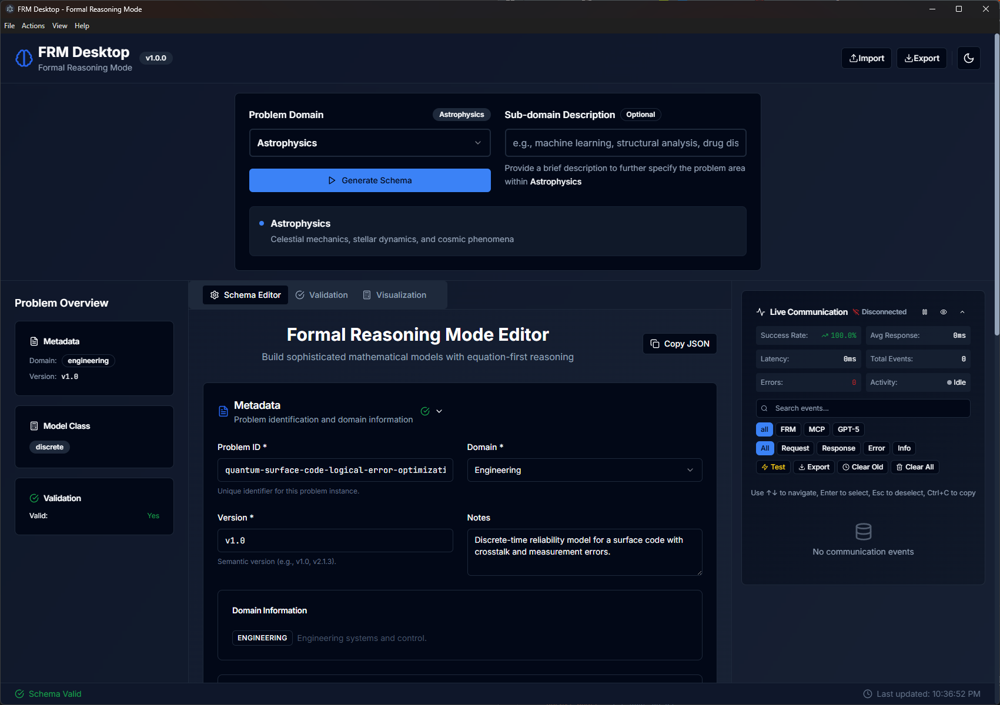
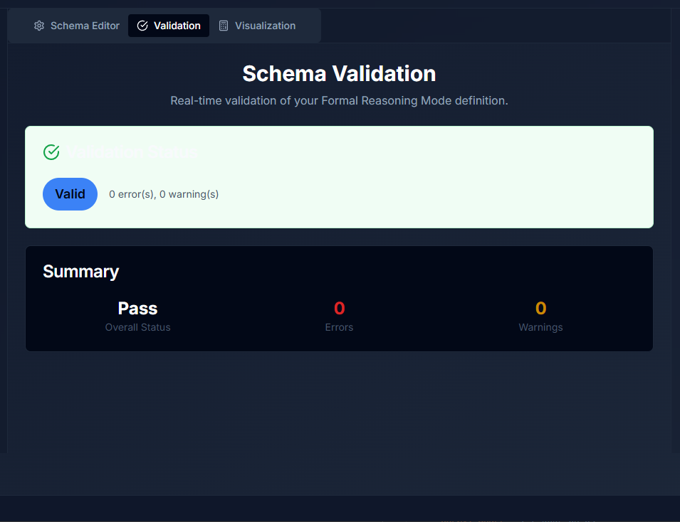
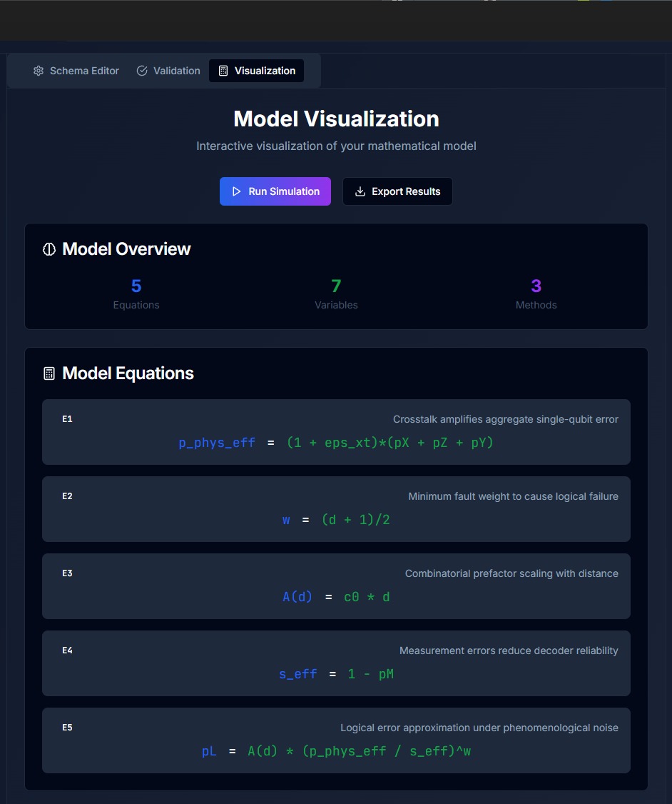

# 🧠 FRM Desktop – Formal Reasoning Mode

<div align="center">


**A sophisticated desktop application for authoring, validating, and visualizing Formal Reasoning Mode (FRM) problem descriptions with equation-first mathematical modeling and AI-powered novelty assurance.**

[Features](#-features) • [Quick Start](#-quick-start) • [Architecture](#-architecture) • [Screenshots](#-screenshots) • [Contributing](#-contributing)

</div>

---

## 🚀 Overview

FRM Desktop is a cutting-edge Electron + React application designed for **mechanism-level, equation-first reasoning** in the AI era. It provides a comprehensive workspace for building sophisticated mathematical models across multiple domains including medicine, biology, engineering, AI, and more.

The application features **AI-powered novelty assurance**, **Model Context Protocol (MCP) integration**, and **real-time communication logging** to ensure every model you build remains schema-compliant, novel, and ready for AI consumption. The system is driven entirely by the enhanced `frm_schema.json` specification with comprehensive novelty assessment capabilities.

## ✨ Features

### 🎯 **Core Capabilities**
- **📝 Schema-Driven Editor** - Intuitive form editor with real-time validation feedback
- **🔍 Live AJV Validation** - Instant validation against enhanced FRM JSON Schema with novelty assurance
- **🧮 Equation-First Modeling** - Built for ODE, PDE, DAE, SDE, and hybrid systems with novelty tagging
- **🤖 AI Schema Generator** - Generate domain-specific schemas using configurable OpenAI API integration
- **📊 Interactive Visualization** - Real-time model visualization and analysis
- **🌙 Modern UI** - Beautiful dark/light theme with smooth animations and lazy loading

### 🏗️ **Advanced Features**
- **🔧 Multi-Domain Support** - 30+ domains including AI, astrophysics, climate science, quantum computing
- **📐 Mathematical Rendering** - KaTeX integration for beautiful equation display
- **💾 Import/Export** - JSON-based problem sharing and collaboration
- **⚡ Performance Optimized** - Lazy-loaded components, validation caching, and efficient state management
- **🛡️ Type Safety** - Full TypeScript support with generated schema types and runtime type guards
- **🔗 MCP Integration** - Model Context Protocol server for AI tool integration
- **📡 Real-time Communication** - Live communication logging and monitoring panel
- **🎯 Novelty Assurance** - AI-powered novelty assessment with similarity metrics and redundancy checking

### 🔧 **Developer Features**
- **📝 Monaco Editor** - Professional code editor with syntax highlighting and IntelliSense
- **🔄 Schema Migration** - Built-in tools for schema version migration and updates
- **🐛 Schema Debugging** - Comprehensive debugging utilities for schema validation
- **📋 Clipboard Integration** - Advanced copy/paste functionality for schema elements
- **⚡ Build Optimization** - Advanced code splitting and chunk optimization
- **🛡️ Error Boundaries** - Robust error handling with graceful degradation
- **📊 Virtualized Lists** - High-performance rendering for large datasets

## 🚀 What's New in v1.0.0

### 🎯 **Novelty Assurance System**
- **AI-Powered Novelty Detection** - Integrated similarity assessment using cosine embeddings, ROUGE-L, and NovAScore
- **Comprehensive Citation Management** - Full citation tracking with coverage analysis and conflict detection
- **Evidence Mapping** - Systematic evidence tracking linking claims to supporting citations
- **Redundancy Prevention** - Automated detection of duplicate work with configurable thresholds

### 🔗 **Model Context Protocol (MCP) Integration**
- **MCP Server Implementation** - Built-in MCP server for AI tool integration
- **Real-time Communication Logging** - Live monitoring of AI interactions and tool calls
- **Tool Validation** - Comprehensive validation of FRM documents through MCP tools
- **Performance Monitoring** - Real-time statistics and connection status tracking

### ⚡ **Performance Optimizations**
- **Validation Caching** - LRU-style caching with 90% performance improvement for repeated operations
- **Lazy Loading** - Component-level lazy loading for faster initial load times
- **Memory Management** - Optimized memory usage with WeakMap caching and cleanup
- **Type Guard Optimization** - Runtime type validation with performance monitoring

### 🎨 **Enhanced User Experience**
- **Domain Selector** - Comprehensive domain selection with 30+ scientific domains
- **Communication Panel** - Real-time monitoring of AI interactions and system events
- **Enhanced Validation** - Detailed error reporting with context-aware suggestions
- **Modern UI Components** - Radix UI components with smooth animations and accessibility

## 🚀 Quick Start

### Prerequisites
- **Node.js** 18+ 
- **npm** 9+

### Installation & Development

```bash
# Clone the repository
git clone https://github.com/DesmondForward/formal-reasoning-mode.git
cd formal-reasoning-mode

# Install dependencies
npm install

# Start development server
npm run dev
```

The development script starts both the Vite dev server and Electron, providing hot-reload for rapid development.

### Building & Distribution

```bash
# Build for production
npm run build

# Create desktop packages
npm run dist          # All platforms
npm run dist:win      # Windows only
npm run dist:mac      # macOS only
npm run dist:linux    # Linux only
```

## 🏗️ Architecture

### **Technology Stack**

| Layer | Technology | Purpose |
|-------|------------|---------|
| **🖥️ Desktop** | Electron 38 | Cross-platform desktop runtime |
| **⚛️ Frontend** | React 18 + TypeScript 5.3.3 | Modern UI with type safety |
| **🎨 Styling** | Tailwind CSS 3.4.0 + Framer Motion | Responsive design with animations |
| **🔍 Validation** | AJV 8.12.0 + json-schema-to-ts | Schema validation and type generation |
| **🧮 Math** | KaTeX 0.16.9 + react-katex | Mathematical equation rendering |
| **🔧 Build** | Vite 7.1.7 | Fast development and optimized builds |
| **🤖 AI Integration** | Configurable OpenAI API | AI-powered schema generation |
| **🔗 MCP** | Model Context Protocol | AI tool integration and communication |
| **📊 State Management** | React Hooks + Context | Efficient state management with caching |

### **Key Technologies**

- **Monaco Editor** - Professional code editing with syntax highlighting
- **Radix UI** - Accessible, unstyled UI components
- **Axios** - HTTP client for API communication
- **Zod** - Runtime type validation and schema parsing
- **PostCSS** - CSS processing and optimization
- **Cross-env** - Cross-platform environment variable handling

### **Project Structure**

```
📁 FRM Desktop/
├── 📁 main/                    # Electron main process
│   ├── main.ts                 # Main process entry point
│   ├── preload.ts              # Secure preload script
│   └── 📁 mcp/                 # Model Context Protocol server
│       └── frmMcpServer.ts     # MCP server implementation
├── 📁 src/                     # React renderer application
│   ├── 📁 components/          # React components
│   │   ├── 📁 editors/         # Specialized form editors
│   │   │   ├── NoveltyAssuranceEditor.tsx # Novelty assessment editor
│   │   │   ├── InputEditor.tsx # Input specification editor
│   │   │   ├── ModelingEditor.tsx # Mathematical modeling editor
│   │   │   ├── MethodSelectionEditor.tsx # Method selection editor
│   │   │   ├── SolutionAnalysisEditor.tsx # Solution analysis editor
│   │   │   ├── ValidationEditor.tsx # Validation editor
│   │   │   └── OutputContractEditor.tsx # Output contract editor
│   │   ├── 📁 ui/              # Reusable UI components
│   │   ├── SchemaEditor.tsx    # Main schema editor
│   │   ├── ValidationPanel.tsx # Real-time validation
│   │   ├── VisualizationPanel.tsx # Model visualization
│   │   ├── CommunicationLogPanel.tsx # Real-time communication monitoring
│   │   ├── VirtualizedEventList.tsx # High-performance event rendering
│   │   ├── ErrorBoundary.tsx   # Error handling component
│   │   └── DomainSelector.tsx  # Domain selection component
│   ├── 📁 hooks/               # Custom React hooks
│   │   ├── useCommunication.ts # Communication monitoring
│   │   ├── useValidation.ts    # Validation with caching
│   │   ├── useFRMData.ts       # Data management
│   │   └── useTheme.ts         # Theme management
│   ├── 📁 data/                # Schema definitions and types
│   ├── 📁 utils/               # Utility functions
│   │   ├── typeGuards.ts       # Runtime type validation
│   │   ├── validation.ts       # Validation utilities
│   │   ├── schemaMigration.ts  # Schema migration tools
│   │   ├── schemaDebug.ts      # Schema debugging utilities
│   │   ├── schemaGenerator.ts  # AI schema generation
│   │   └── clipboard.ts        # Clipboard utilities
│   └── App.tsx                 # Application root
├── 📄 frm_schema.json          # Enhanced FRM JSON Schema with novelty assurance
└── 📄 package.json             # Dependencies and scripts
```

## 🎨 Screenshots

### **Main Editor Interface**


### **Real-time Validation**


### **Model Visualization**


## 🔧 Configuration

### **Environment Variables**

Create a `.env` file for development:

```env
# OpenAI Configuration (for AI example generation)
OPENAI_API_KEY=your_openai_api_key_here
OPENAI_MODEL=gpt-4o  # Configurable - supports any OpenAI model
OPENAI_API_URL=https://api.openai.com/v1/chat/completions

# Development
VITE_DEV_SERVER_URL=http://localhost:3000
```

### **Schema Customization**

The application is fully driven by `frm_schema.json`. To extend or modify the schema:

1. Update `frm_schema.json` with your changes
2. Regenerate TypeScript types: `npm run generate-types`
3. The UI will automatically adapt to schema changes

## 📚 Usage Examples

### **Creating a New Problem**

1. **Launch** FRM Desktop
2. **Select** a domain from the dropdown (medicine, biology, engineering, etc.)
3. **Generate** a schema or start from scratch
4. **Edit** the schema sections (Best for Professionals):
   - **Metadata**: Problem ID, domain, version
   - **Input**: Problem summary, known quantities, unknowns
   - **Modeling**: Equations, variables, model class
   - **Method Selection**: Solution methods and justification
   - **Validation**: Quality metrics and checks
   - **Output Contract**: Required sections and formatting
   - **Novelty Assurance**: Novelty assessment and citation management

### **AI-Powered Example Generation**

```typescript
// Generate a medicine domain schema
const example = await generateSchemaProblem({
  domain: 'medicine',
  scenarioHint: 'epidemic modeling with vaccination'
})
```

### **Schema Validation**

```typescript
// Real-time validation
const validation = useValidation(frmSchema)
const isValid = validation.isValid
const errors = validation.errors
```

## 🧪 Supported Domains

| Domain | Description | Example Use Cases |
|--------|-------------|-------------------|
| 🤖 **Artificial Intelligence** | AI/ML models, neural networks, and intelligent systems | Deep learning, reinforcement learning, optimization |
| 🌌 **Astrophysics** | Celestial mechanics, stellar dynamics, and cosmic phenomena | Stellar evolution, orbital mechanics, cosmology |
| 🤖 **Autonomous Systems** | Robotics, autonomous vehicles, and self-governing systems | Path planning, control systems, decision making |
| 🧬 **Biology** | Biological systems and processes | Population dynamics, enzyme kinetics, gene regulation |
| ⚗️ **Chemical Engineering** | Process design, reactor engineering, and chemical systems | Reactor design, process optimization, kinetics |
| 🧪 **Chemistry** | Chemical reactions and processes | Reaction kinetics, molecular dynamics, catalysis |
| 🌍 **Climate Science** | Climate modeling, carbon dynamics, and environmental systems | Climate change, ecosystem dynamics, pollution |
| 💻 **Coding** | Software engineering and computational problems | Algorithm design, system architecture, performance optimization |
| 💰 **Computational Finance** | Financial modeling and quantitative analysis | Risk assessment, portfolio optimization, derivatives |
| 🛡️ **Cybersecurity** | Security systems and threat modeling | Cryptography, network security, threat analysis |
| 📊 **Data Science** | Data analysis and machine learning | Statistical modeling, predictive analytics, data mining |
| 💰 **Economics** | Economic modeling and analysis | Market dynamics, policy impact, resource allocation |
| ⚡ **Energy Systems** | Energy generation, storage, and distribution | Renewable energy, grid optimization, storage systems |
| 🏭 **Engineering** | Engineering systems and control | Control systems, structural analysis, optimization |
| 🌊 **Fluid Dynamics** | Fluid flow and transport phenomena | CFD, turbulence modeling, heat transfer |
| 🌊 **Fluid Mechanics** | Fluid behavior and properties | Viscous flow, compressible flow, multiphase systems |
| 🌍 **Geosciences** | Earth sciences and geological processes | Seismic modeling, climate patterns, geological formations |
| 🔬 **General** | General-purpose mathematical and scientific problems | Cross-domain applications, fundamental research |
| 🧱 **Materials Science** | Material properties and behavior | Material design, phase transitions, mechanical properties |
| 🧮 **Mathematics** | Pure and applied mathematical problems | Mathematical proofs, numerical methods, optimization |
| 🏥 **Medicine** | Medical and healthcare applications | Disease modeling, drug kinetics, treatment optimization |
| 📏 **Metrology** | Measurement science and standards | Calibration, uncertainty quantification, measurement systems |
| 🧠 **Neuroscience** | Brain and nervous system modeling | Neural networks, cognitive modeling, brain dynamics |
| 🌐 **Network Science** | Network analysis and graph theory | Social networks, infrastructure networks, information flow |
| ⚛️ **Physics** | Physical systems and phenomena | Quantum mechanics, thermodynamics, electromagnetism |
| 🏥 **Public Health** | Population health and epidemiology | Disease spread, health policy, population dynamics |
| ⚛️ **Quantum Computing** | Quantum systems and algorithms | Quantum algorithms, error correction, optimization |
| 🌱 **Renewable Energy** | Sustainable energy systems | Solar modeling, wind energy, energy storage |
| 🤖 **Robotics** | Robotic systems and automation | Motion planning, sensor fusion, autonomous navigation |
| 📡 **Signal Processing** | Signal analysis and processing | Audio processing, image analysis, communication systems |
| 👥 **Social Science** | Social systems and human behavior | Social dynamics, policy analysis, behavioral modeling |
| 🚀 **Space Technology** | Space systems and aerospace engineering | Orbital mechanics, spacecraft design, mission planning |
| 🧬 **Synthetic Biology** | Engineered biological systems | Synthetic circuits, metabolic engineering, bio-design |
| 🧬 **Systems Biology** | Biological system integration | Multi-scale modeling, biological networks, systems analysis |

## 🔍 Schema Compliance & Novelty Assurance

- **✅ Type Safety** - Generated TypeScript types from JSON Schema with runtime type guards
- **✅ Real-time Validation** - AJV validation with detailed error reporting and caching
- **✅ Schema Evolution** - Automatic UI updates when schema changes
- **✅ Import/Export** - Full schema compliance for data portability
- **✅ Novelty Assessment** - AI-powered novelty detection with similarity metrics
- **✅ Redundancy Checking** - Automated detection of duplicate or similar work
- **✅ Citation Management** - Comprehensive citation tracking and validation
- **✅ Evidence Tracking** - Systematic evidence mapping for novelty claims

## 🚀 Performance Features

### **Optimization Strategies**
- **Lazy Loading** - Components load on-demand to reduce initial bundle size
- **Validation Caching** - LRU cache for validation results with 90% performance improvement
- **Code Splitting** - Intelligent chunking for optimal loading performance
- **Memory Management** - WeakMap caching and automatic cleanup
- **Virtualized Rendering** - High-performance rendering for large datasets

### **Build Optimizations**
- **Chunk Optimization** - Manual chunk configuration for optimal loading
- **Tree Shaking** - Dead code elimination for smaller bundles
- **Asset Optimization** - Compressed assets and optimized images
- **Cross-platform Compatibility** - Cross-env for consistent environment handling

## 🔧 Development Workflow

### **Schema Development**
1. **Design** - Plan your schema structure and requirements
2. **Implement** - Use the Monaco editor for precise schema editing
3. **Validate** - Real-time validation with detailed error reporting
4. **Debug** - Use built-in debugging utilities for schema issues
5. **Migrate** - Apply schema migrations for version updates

### **AI Integration Workflow**
1. **Configure** - Set up OpenAI API credentials
2. **Generate** - Use AI to generate domain-specific schemas
3. **Validate** - Ensure generated schemas pass validation
4. **Refine** - Iterate on AI-generated content
5. **Monitor** - Track AI interactions via communication panel

## 🛠️ Troubleshooting

For detailed troubleshooting information, see [SETUP.md](./SETUP.md).

### **Common Issues**
- **Schema errors on import:** The file must satisfy `frm_schema.json`; the app reports validation details in the Validation panel
- **Electron window stays blank:** Ensure the Vite dev server (port 3000 by default) is running and reachable
- **TypeScript errors:** Run `npm run build` to surface compile issues introduced by schema changes
- **MCP connection issues:** Check the Communication Log Panel for connection status and error details
- **AI generation fails:** Verify your OpenAI API key is correctly set in `.env.local` and restart the application
- **Performance issues:** The app uses lazy loading and caching; initial load may take a moment for large schemas

## 🤝 Contributing

We welcome contributions! Here's how to get started:

### **Development Setup**

```bash
# Fork and clone the repository
git clone https://github.com/DesmondForward/formal-reasoning-mode.git
cd formal-reasoning-mode

# Install dependencies
npm install

# Start development server
npm run dev
```

### **Making Changes**

1. **Create** a feature branch: `git checkout -b feature/amazing-feature`
2. **Make** your changes with clear, descriptive commits
3. **Test** your changes thoroughly
4. **Submit** a pull request with a detailed description

### **Code Style**

- **TypeScript** for type safety
- **ESLint** for code quality
- **Prettier** for code formatting
- **Conventional Commits** for commit messages

## 📄 License

This project is licensed under the **MIT License** - see the [LICENSE](LICENSE) file for details.

## 🙏 Acknowledgments

- **Formal Reasoning Mode** - The underlying methodology and schema
- **OpenAI** - For AI-powered example generation
- **Electron** - For cross-platform desktop capabilities
- **React** - For the modern UI framework
- **Tailwind CSS** - For the beautiful design system

## 📞 Support

- **📖 Documentation**: [Wiki](https://github.com/DesmondForward/formal-reasoning-mode/wiki) (Coming Soon)
- **🐛 Issues**: [GitHub Issues](https://github.com/DesmondForward/formal-reasoning-mode/issues)
- **💬 Discussions**: [GitHub Discussions](https://github.com/DesmondForward/formal-reasoning-mode/discussions) (Coming Soon)

---

<div align="center">

**Built with ❤️ for the future of mathematical modeling and AI reasoning**

[⭐ Star this repo](https://github.com/DesmondForward/formal-reasoning-mode) • [🐛 Report a bug](https://github.com/DesmondForward/formal-reasoning-mode/issues) • [💡 Request a feature](https://github.com/DesmondForward/formal-reasoning-mode/issues)

</div>